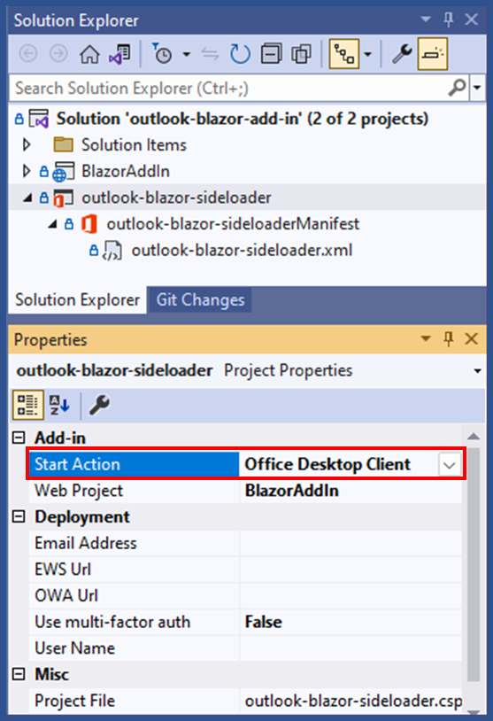

# Outlook Email Count Add-In

## Project Scope: Outlook Plugin for Daily Email Count

### Project Overview
The objective of this project is to develop an Outlook plugin that adds a button to the Outlook interface. When clicked, this button will display the total number of emails received by the user on the current day.

### Objectives
- **Develop an Outlook plugin compatible with the latest versions of Outlook.**
- **Integrate a user-friendly button into the Outlook toolbar.**
- **Implement functionality to count and display the number of emails received in a day.**

### Deliverables
1. **Outlook Plugin**: A fully functional plugin that can be installed and used within Outlook.
2. **User Interface**: A button added to the Outlook toolbar.
3. **Email Counting Functionality**: Code to count the number of emails received in the current day.
4. **Documentation**: Detailed documentation covering installation, usage, and troubleshooting.

### Technical Requirements
- **Programming Language**: C# and Blazor
- **Development Environment**: Visual Studio.
- **Outlook API**: Utilize the Outlook REST API or Microsoft Graph API to access email data.

### Resources
- [GitHub - Office Add-ins Samples](https://github.com/OfficeDev/Office-Add-in-samples/tree/main/Samples/blazor-add-in/outlook-blazor-add-in)

### Success Criteria
- The plugin is successfully installed and used by the target audience.
- The button accurately counts and displays the number of emails received in a day.
- Positive feedback from users regarding the plugin's functionality and ease of use.

## Features

- Count emails received on the current day.
- Display email count in a user-friendly interface within Outlook.
- Interact with Microsoft Graph API or Outlook REST API to fetch email data.

## Applies to

- Outlook on the web, Windows, and Mac.

## Prerequisites

- Microsoft 365 - Get a [free developer sandbox](https://developer.microsoft.com/microsoft-365/dev-program#Subscription) that provides a renewable 90-day Microsoft 365 E5 developer subscription.

- # Outlook Blazor Add-In

This project is a **Blazor-based Office Add-in** for Outlook, named `outlook-blazor-add-in`. It integrates a Blazor WebAssembly app with an Office Add-in to extend Outlook's functionality. Below is a breakdown of how the project works and how the files interact.

## Getting Started

Here is the link to manage MS Add-ins in the new Outlook:

[https://aka.ms/olksideload](https://aka.ms/olksideload)

This link was copied from the help menu after searching for "Add-ins", selecting "Use add-ins in Outlook", and scrolling to the link.

## Explore the Project:

- The **`./manifest.json`** or **`./manifest.xml`** file in the root directory defines the settings and capabilities of the add-in.
- The **`./src/taskpane/taskpane.html`** file contains the HTML markup for the task pane.
- The **`./src/taskpane/taskpane.css`** file contains the CSS applied to content in the task pane.
- The **`./src/taskpane/taskpane.js`** file includes the Office JavaScript API code that facilitates interaction between the task pane and Outlook.

## Solution Overview

The solution contains two projects:
1. **BlazorAddIn** (Blazor WebAssembly project):  
   This is the main project where the Blazor components and logic for the add-in are implemented.
2. **outlook-blazor-sideloader**:  
   This project holds the manifest files used to deploy the Office Add-in to Outlook.

## BlazorAddIn Project Breakdown

### `wwwroot` Folder
Contains static assets served by the Blazor WebAssembly app:
- **CSS**: `app.css` styles the application.
- **Images**: Assets like `favicon.ico` and `icon-192.png` are typically used for branding the add-in.
- **`BlazorAddIn.lib.module.js`**: A JavaScript file that bridges JavaScript functions with Blazor, essential for interacting with Outlook APIs (e.g., Office.js).

### `Model` Folder
- **`MailRead.cs`** and its namespace **`MailRead`**:
  - Defines data structures or models related to email data (e.g., sender, subject, body, etc.).
  - These models may interact with Outlook data fetched using Office.js or other APIs.

### `Pages` Folder
- **`Index.razor`** and **`Index.razor.cs`**:
  - The primary page/component of the add-in.
  - **`Index.razor.cs`** contains C# code-behind logic for **`Index.razor`**, separating UI and business logic.
  - **`Index.razor.js`**: A JavaScript file possibly used for direct interaction with Outlook web add-in's JavaScript APIs or custom functionality.

### `Shared` Folder
- Common UI components shared across the application:
  - **`MainLayout.razor`**: Main layout of the app, defining the structure of pages.
  - **`NavMenu.razor`**: Navigation menu component, likely used for in-app navigation.

### `Program.cs`
- Entry point for the Blazor WebAssembly app:
  - Configures services and initializes the app.
  - Sets up the app to run within the context of an Office Add-in.

## outlook-blazor-sideloader Project

This project contains the manifest files for deploying and sideloading the Office Add-in in Outlook.

- **Manifest Files:**
  - **`outlook-blazor-sideloaderManifest.xml`**: Contains metadata for the Office Add-in, including:
    - Add-in's ID, name, description.
    - URLs for the add-in's pages.
    - Permissions and Outlook-specific configurations (e.g., whether it works in Mail, Calendar, etc.).
  - **`outlook-blazor-sideloader.xml`**: Likely another configuration file for sideloading or testing the add-in locally.

## How It Works Together

### Development Flow:
- The Blazor app (**`BlazorAddIn`**) provides UI and functionality using Razor components and Blazor's event-handling.
- Static files in **`wwwroot`** and JavaScript modules enable integration with Outlook via Office.js.

### Office Integration:
- The add-in manifest specifies entry points (e.g., **`Index.razor`**) and necessary permissions for interacting with Outlook data.
- JavaScript files like **`BlazorAddIn.lib.module.js`** act as a bridge between the Blazor app and Outlook APIs.

### Deployment:
- The manifest files in **`outlook-blazor-sideloader`** are used to deploy the add-in to Outlook, enabling sideloading during development or production use.

## Interaction Between Files
- Razor Components (`.razor`) define UI and call backend logic in `.razor.cs` files or services.
- Static files in **`wwwroot`** (like JavaScript and CSS) enhance interactivity and styling.
- Models (**`MailRead.cs`**) structure data retrieved from Outlook.
- The manifest (**`.xml`**) integrates the Blazor app as an Office Add-in in Outlook.

---

## Troubleshooting Steps

### 1. **Ensure Task Pane is Enabled**
- Open Outlook → File → Options → Add-ins.
- Check "Inactive Add-ins" or "Disabled Add-ins."
- If it's disabled, enable it.

### 2. **Restart Outlook & Clear Cache**
- Close Outlook.
- Run the following command in Command Prompt (as Administrator) to clear cache:
  ```powershell
  taskkill /IM outlook.exe /F
  ipconfig /flushdns


## Run the sample

1. Download or clone the [Office Add-ins samples repository](https://github.com/OfficeDev/Office-Add-in-samples).
1. Open Visual Studio 2022 and open the **Office-Add-in-samples\Samples\outlook-email-count-add-in\outlook-email-count-add-in.sln** solution.
1. In **Solution Explorer**, select the **outlook-email-count-sideloader** project. Then display the project properties (F4).
1. In the **Properties** window, set the **Start Action** to **Office Desktop Client**.
   
1. In the **Properties** window, set the **Email Address** to the email address of the account you want to use with this sample.
   In case this was not set before running, you might also see this dialog:
   
1. To start the solution, choose **Debug** > **Start Debugging** or press **F5**.
1. When Outlook opens, choose **Home** > **Show Taskpane**.

The task pane will display the email count for the current day.

## Understand the Add-In's Functionality

This Outlook add-in is a web application that adds functionality to Outlook, allowing users to count and display the number of emails received on the current day. It leverages Microsoft Graph API or Outlook REST API to retrieve email data, and Blazor WebAssembly to build the user interface.

## Key parts of this sample

The add-in is built using Blazor WebAssembly, and it utilizes C# and JavaScript interop to interact with the Outlook APIs.

### Blazor pages

The **Pages** folder contains the Blazor pages, such as **Index.razor**. Each **.razor** page also has two code-behind pages, for example, **Index.razor.cs** and **Index.razor.js**. The C# file sets up the interop connection with the JavaScript file.

```csharp
protected override async Task OnAfterRenderAsync(bool firstRender)
{
  if (firstRender)
  {
    JSModule = await JSRuntime.InvokeAsync<IJSObjectReference>("import", "./Pages/Index.razor.js");
  }
}
