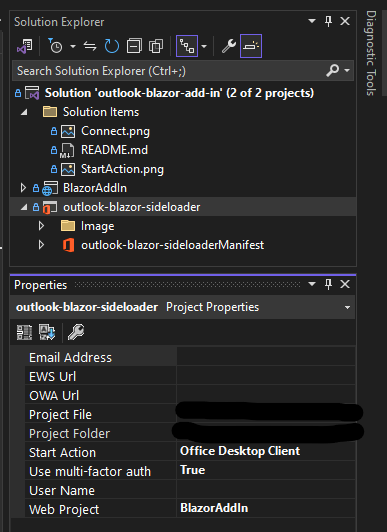
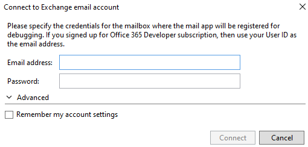

# Outlook Email Count Add-In - User Guide

## Overview
This guide provides step-by-step instructions on how to use the **Outlook Email Count Add-In**, which counts the number of emails you have received on the current day and the number of unread emails in mailbox. The add-in adds a button to your Outlook interface, allowing you to easily track your email count.

### Key Features:
- Count emails received on the current day.
- Display email count within the Outlook interface.

## Prerequisites

- **Microsoft 365 Account**: You'll need a Microsoft 365 subscription to use the add-in.
- **Outlook (Desktop or Web)**: This add-in is compatible with both Outlook Desktop (Windows) and Outlook Web (Outlook on the Web).

  ### Technical Requirements
- **Programming Language**: C# and Blazor
- **Development Environment**: Visual Studio.
- **Outlook API**: Outlook REST API and EWS Requests.

To get started, you will need to add the plugin to Outlook. Follow the instructions for the appropriate version below.

## Run the sample

1. Download or clone the (https://github.com/WaldoN22/Analyte-Add-In.git)).
2. Open Visual Studio 2022 and open the **outlook-blazor-add-in.sln**.
3. In **Solution Explorer** select the **outlook-blazor-sideloader** project. Then display the project properties (F4).
4. In the **Properties** window, set the **Start Action** to **Office Desktop Client**.
   
   
5. In the **Properties** window, set the **Email Address** to the email address of the account you want to use with this add-in and also switch **Use multi-factor auth** to **True**.
   In case this was not set before running you might also see this dialog:
   
6. To start the solution, choose **Debug** > **Start Debugging** or press **F5**.
7. When Outlook opens, choose **Home** > **Show Taskpane**.

## How to Manually Add the Add-In to Outlook

### For Outlook Desktop (Windows):
1. **Open Outlook**: Launch the Outlook application on your computer.
2. **Go to File**: In the top left corner, click on the "File" tab.
3. **Manage Add-ins**: Under the "Manage Add-ins" section, click on "Manage Add-ins" or "Options" to open the Outlook Web App.
4. **Add Custom Add-in**:
   - Click the **+** icon at the top to add a new add-in.
   - Select **Add from file** (this allows you to add an add-in file such as an .xml manifest file).
5. **Select the Add-in**: Locate and select the manifest file for the add-in on your computer.
6. **Confirm**: Once added, the add-in will appear in your list of installed add-ins. You can enable or disable it as needed.

For additional help with managing add-ins, refer to [Microsoft's link for Outlook add-ins](https://aka.ms/olksideload).

### For Outlook Web (Outlook on the Web):
1. **Go to Settings**: Open Outlook Web and click on the gear icon in the top right corner to open Settings.
2. **View All Outlook Settings**: At the bottom of the settings panel, click on "View all Outlook settings."
3. **Mail > Customize Actions**: In the settings window, go to Mail > Customize Actions.
4. **Manage Add-ins**: Scroll to the Add-ins section and click on "Manage add-ins."
5. **Add Custom Add-in**:
   - Click the **+** sign at the top and choose **Add from file**.
   - Select the manifest file on your computer, then confirm.

## BlazorAddIn Project Breakdown

### `wwwroot` Folder
Contains static assets served by the Blazor WebAssembly app:
- **CSS**: `app.css` styles the application.
- **Images**: Assets like `favicon.ico` and `icon-192.png` are typically used for branding the add-in.
- **`BlazorAddIn.lib.module.js`**: A JavaScript file that bridges JavaScript functions with Blazor, essential for interacting with Outlook APIs (e.g., Office.js).

### `Model` Folder
- **`MailRead.cs`** and its namespace **`MailRead`**:
  - Defines data structures or models related to email data (e.g., sender, subject, body, etc.).
  - These models may interact with Outlook data fetched using Office.js or other APIs.

### `Pages` Folder
- **`Index.razor`** and **`Index.razor.cs`**:
  - The primary page/component of the add-in.
  - **`Index.razor.cs`** contains C# code-behind logic for **`Index.razor`**, separating UI and business logic.
  - **`Index.razor.js`**: A JavaScript file possibly used for direct interaction with Outlook web add-in's JavaScript APIs or custom functionality.

### `Shared` Folder
- Common UI components shared across the application:
  - **`MainLayout.razor`**: Main layout of the app, defining the structure of pages.
  - **`NavMenu.razor`**: Navigation menu component, likely used for in-app navigation.

### `Program.cs`
- Entry point for the Blazor WebAssembly app:
  - Configures services and initializes the app.
  - Sets up the app to run within the context of an Office Add-in.

## outlook-blazor-sideloader Project

This project contains the manifest files for deploying and sideloading the Office Add-in in Outlook.

- **Manifest Files:**
  - **`outlook-blazor-sideloaderManifest.xml`**: Contains metadata for the Office Add-in, including:
    - Add-in's ID, name, description.
    - URLs for the add-in's pages.
    - Permissions and Outlook-specific configurations (e.g., whether it works in Mail, Calendar, etc.).
  - **`outlook-blazor-sideloader.xml`**: Likely another configuration file for sideloading or testing the add-in locally.

## How It Works Together

### Development Flow:
- The Blazor app (**`BlazorAddIn`**) provides UI and functionality using Razor components and Blazor's event-handling.
- Static files in **`wwwroot`** and JavaScript modules enable integration with Outlook via Office.js.

### Office Integration:
- The add-in manifest specifies entry points (e.g., **`Index.razor`**) and necessary permissions for interacting with Outlook data.
- JavaScript files like **`BlazorAddIn.lib.module.js`** act as a bridge between the Blazor app and Outlook APIs.

### Deployment:
- The manifest files in **`outlook-blazor-sideloader`** are used to deploy the add-in to Outlook, enabling sideloading during development or production use.

## Interaction Between Files
- Razor Components (`.razor`) define UI and call backend logic in `.razor.cs` files or services.
- Static files in **`wwwroot`** (like JavaScript and CSS) enhance interactivity and styling.
- Models (**`MailRead.cs`**) structure data retrieved from Outlook.
- The manifest (**`.xml`**) integrates the Blazor app as an Office Add-in in Outlook.

### Example Folder Structure:
./manifest.json ./src/taskpane/taskpane.html ./src/taskpane/taskpane.css ./src/taskpane/taskpane.js

### Troubleshooting

# MessageCount Add-In - Troubleshooting Guide

## Issue: Add-In Not Displaying in Task Pane  

If the add-in does not appear in the task pane, follow these steps:

### 1. Disable "Just My Code" in Visual Studio  
Visual Studio may hide system libraries, preventing you from debugging properly.  

       #### **Steps to Disable "Just My Code"**
        1. Open **Visual Studio**.  
        2. Navigate to **Tools** → **Options**.  
        3. Go to **Debugging** → **General**.  
        4. Uncheck **Enable Just My Code**.  
        5. Restart debugging.

More Troubleshooting on this issue:
1. **Ensure Task Pane is Enabled**: Go to **File > Options > Add-ins** in Outlook and enable the add-in if it's disabled.
2. **Clear Cache**: Close Outlook and run the following command in Command Prompt (as Administrator) to clear the cache:
   ```powershell
   taskkill /IM outlook.exe /F
   ipconfig /flushdns
3. If you encounter issues running this solution in the latest version of Outlook, try running it without the debugger.

**If the issue persists, refer to the full documentation or check the error logs for more details.**

**Additional Resources**

1. https://github.com/OfficeDev/Office-Add-in-samples/tree/main/Samples/blazor-add-in/outlook-blazor-add-in
2. https://youtu.be/pabal0sqzrM?si=y60j0D1WuQ1uZTzx
3. https://learn.microsoft.com/en-gb/office/dev/add-ins/overview/explore-with-script-lab
4. https://learn.microsoft.com/en-us/office/dev/add-ins/quickstarts/outlook-quickstart-vs
5. https://learn.microsoft.com/en-us/office/dev/add-ins/overview/office-add-in-code-samples


   **For additional support, visit the project documentation or contact the development team.**
 ---
**Analyte Consulting**
**@Copyright.**

---
